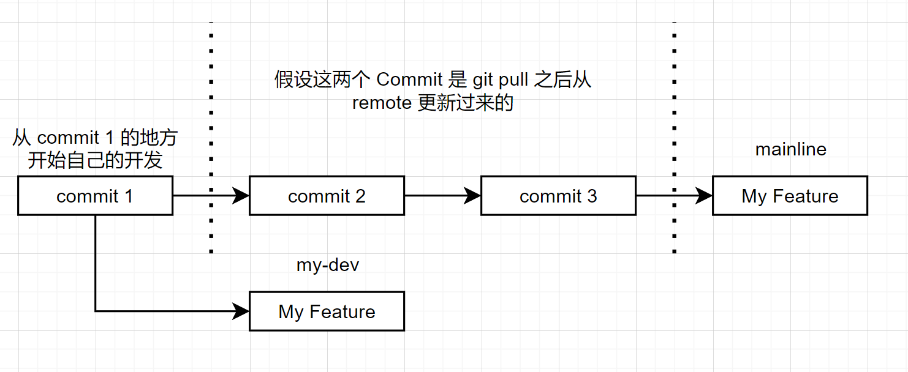
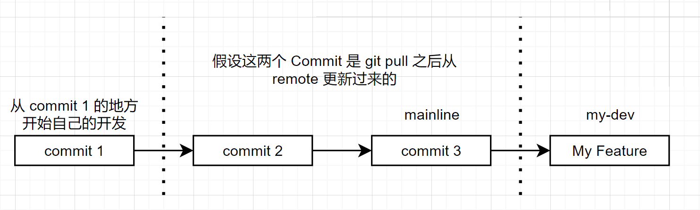
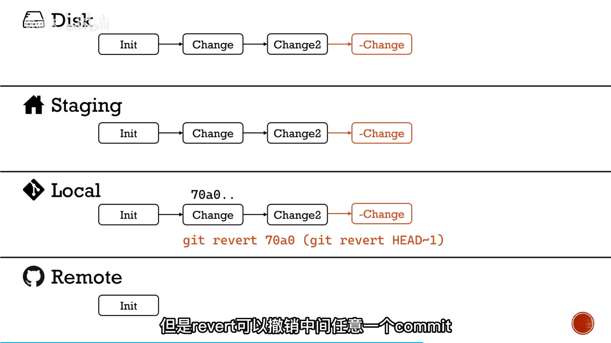

# Rebase

当完成自己代码，准备添加 Project 中的时候，确定 mainline 是最新的， `git pull` 

**假设我们自己的分支（`my-dev`)上只有一个 commit**，所有的修改都在这一个 commit，有两种比较常用选择：

**第一种**：记录下 `my-dev` 分支最新 commit，回到 mainline，使用 `cherry-pick`，`cherry-pick` 把某个 commit 中的修改拿过来，**它不会把那个 commit 之前的修改也一起拿过来！**

```shell
git log # 查看 commit，比如 92f1bb80a18f819a1be68b7b1c2b47f8d18a7ebb
git checkout mainline
git cherry-pick <commit> # 92f1bb80a18f819a1be68b7b1c2b47f8d18a7ebb
```

Branch 的样子就会变成下图的样子



**第二种**：在 `my-dev` 上使用 `git rebase mainline` ，Branch 会变成下面的样子



在第二种方式中，git 其实就是把 `my-dev` 上的修改，全部架到 mainline 上去了，最后记得需要 checkout 回 mainline 执行 merge

```shell
git checkout mainline
git merge my-dev
```


# Add/Push 相关


## Up-Stream

设置 Up Stream，push 的时候添加 `-u` option（设置 Up Stream 是 Branch-to-Branch 绑定的）

```shell
git push -u <remote-repo-name> <local-branch-name>:<remote-branch-name>
```

之后在设置好 Up Stream 的 local branch 执行 `git push` 的时候，就会默认把本地这个 branch 推送到绑定的远端 branch 上


## Undo

代码可以分为四个阶段：Disk（没 add 之前），Staging（add 之后），Local Commit（commit 之后），Remote Commit（push 之后），这四个阶段都有不同的 comman 来 undo

**Disk：**

撤销当前文件所有的修改

```shell
git checkout <file-name>
git restore <file-name>  # 新一点版本 git 有
```


**Staging：**

把 track 的 file 取消掉

```shell
git reset <file-name>
git restore --staged <file-name>
```


**Local Commit：**

这里基本就是回退 HEAD 指针，并且有三种不同的模式：

Soft Reset，只会往前 set 一个 commit 版本，staging 和 disk 的状态不会改变

```shell
git reset --soft HEAD~1  
```

Mix Reset，不仅会往前一个 commit 版本，还会清空 staging，但是disk 上的代码不会改变

```shell
git reset --mixed HEAD~1  # 默认是 mixed
```

Hard Reset，往前一个 commit 版本，清空 staging，并且代码也回回退


**Revert：**

这是一种比较特别的 Undo 方法，它不是往回退，而是创建一个新的 “去掉之前 commit 内容的” 的新的 commit，如下图所示



通常 Remote Master 如果想做删除之前某个 commit，一般用 revert 比较好，因为是往后新创建一个 commit，其他人协作的时候 pull 下来就可以了，不会出现版本不一致问题。

```shell
git revert HEAD~1
git revert <SHA-1 HASH>
```


# Repo/Branch 相关


## Remote Repo

查看所有 remote branch

```shell
git remote -v
```

添加 remote repo，这个 `remote-repo-name` 可以任意起

```shell
git remote add <remote-repo-name> <URL>
```

重命名 remote repo

```shell
git remote rename <old-name> <new-name>
# e.g. git remote rename origin primary
```


## Branch (Create/Delete）

创建新的 branch

```shell
git branch <new-branch-name>  # 不会自动切过去
git checkout -b <new-branch-name>  # 创建新的 branch 并切换过去
```

删除 branch

```shell
git branch -d <branch-name>  # branch 没有被 merge 的话不会成功删除
git branch -D <branch-name>  # 等价于 -d --force

# 删除远端仓库的某个 branch
git branch --delete <remote-repo-name> <remote-branch-name>
```

（这个虽然被删除了，但是通过 commit 的 SHA-1 Hash 还是可以


## Branch (Merge)

Merge 通常来说，不会在本地把 branch merge 到 master(main) 上，而是反过来。因为当在新的 branch 上做新的 feature dev 的时候，master 有可能有新的 commit，导致我们新的 branch 想要 merge 到 master 的时候，就会出现很多问题。所以比较正确的做法就是先在 local master 上 pull 一下，确保代码是最新的，然后 merge 到新的 branch 上，确定没有 conflict 之后，在提交新的 PR/CR。

确保自己在 feature branch 上

```shell
git checkout <dev-branch-name>
```

然后把最新的 master(main) 上的代码 merge 进来

```shell
git merge master
```

最后 push 出去（或提交 CR）


